# **BEGINNER**

## **Git: The Big Picture**

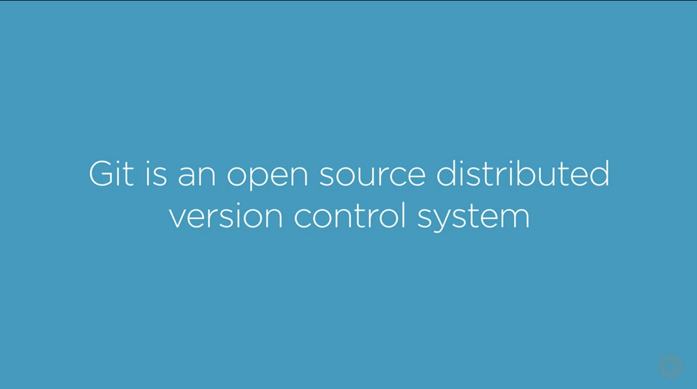
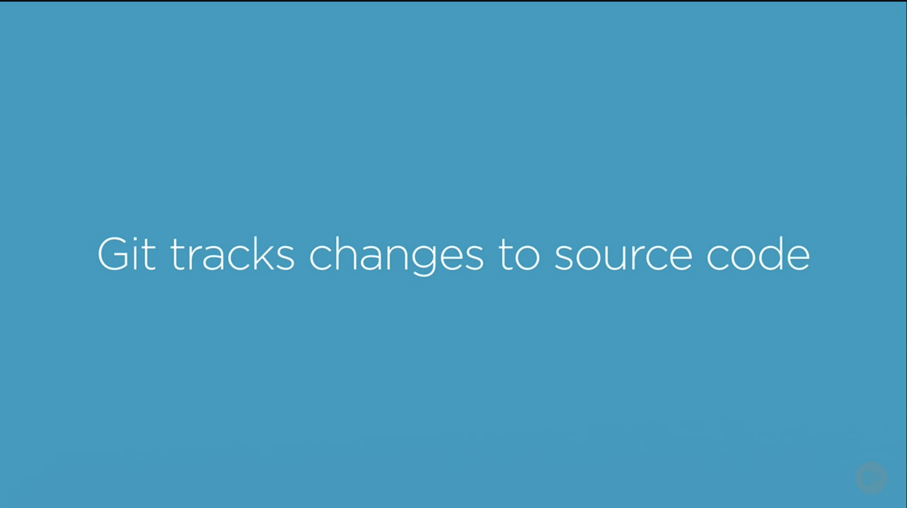

```
git init // create an empty Git repository or reinitialize an existing one
```

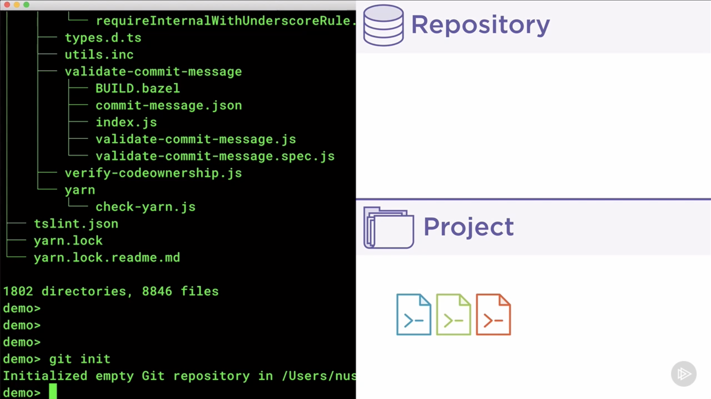

```
git add // add file contents to the index
```

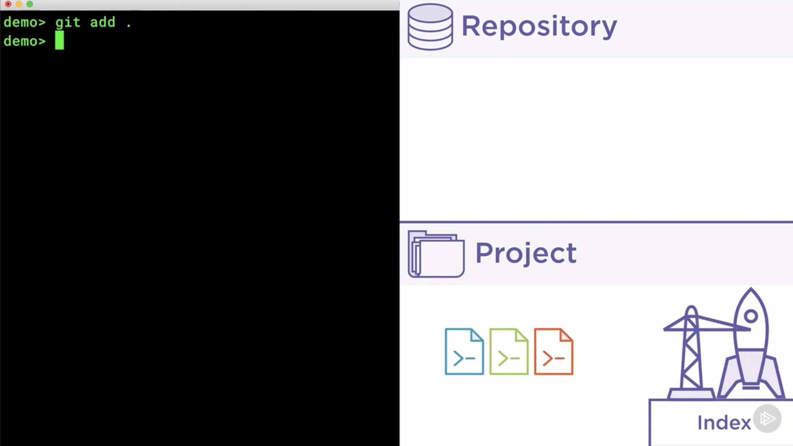

```
git commit -m ‘<commit message>’ // record changes to the repository
```

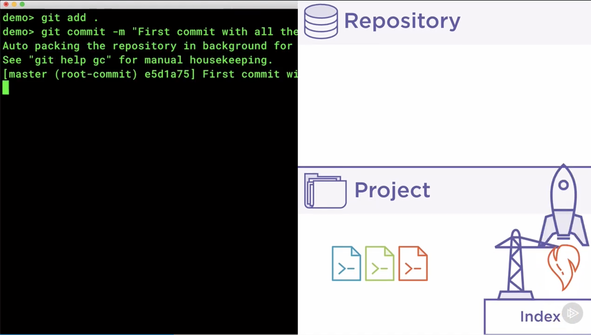
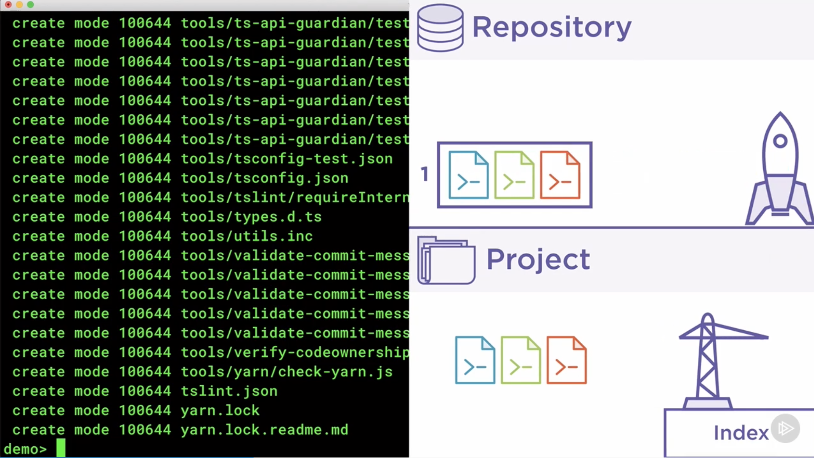

```
git log // show commit logs
```

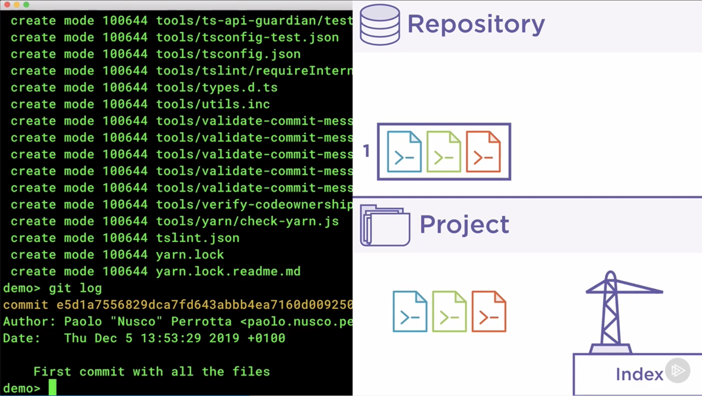

```
git status // show the working tree status
```

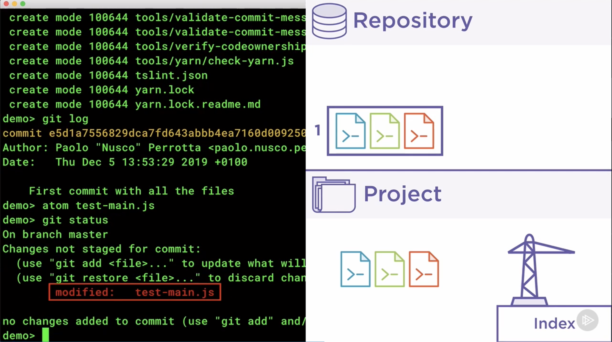

```
git diff <commitid> <commitid> // show changes between commits, commit and working tree, etc
```

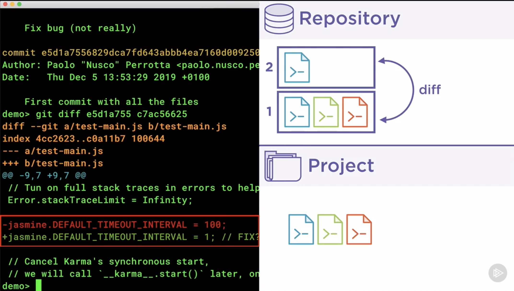

```
git checkout <commitid> // switch branches or restore working tree files
```

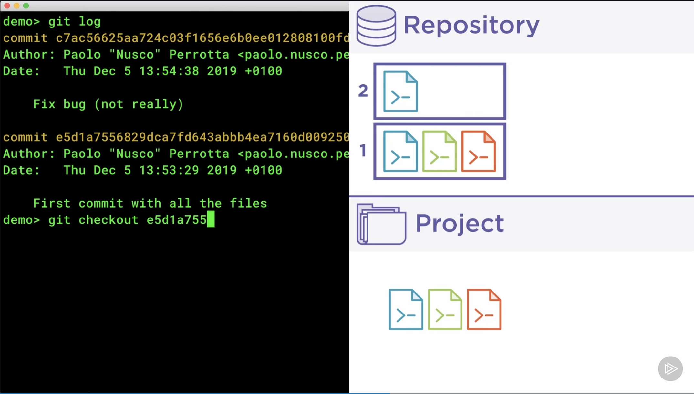

```
git branch <branch name> // create branch
```

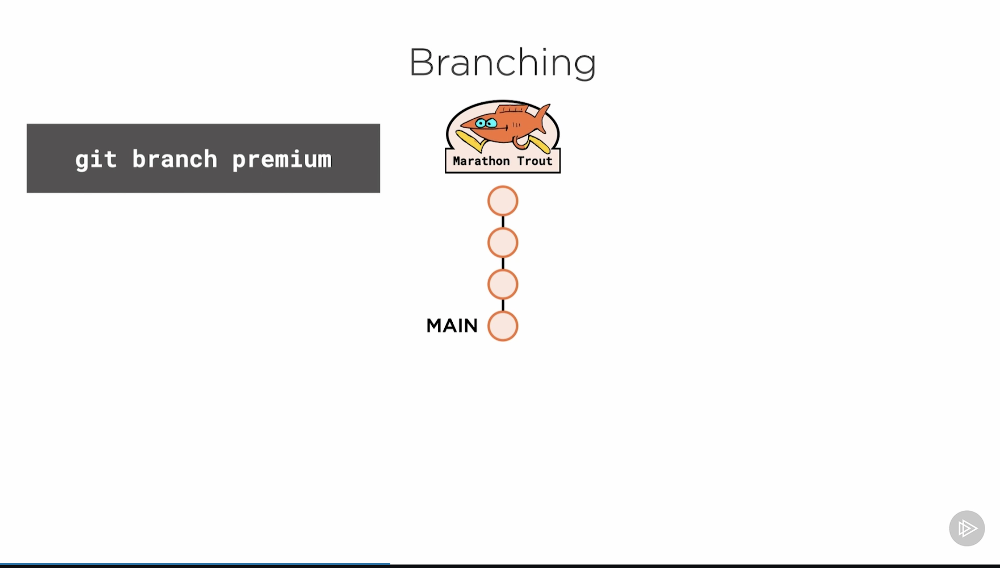
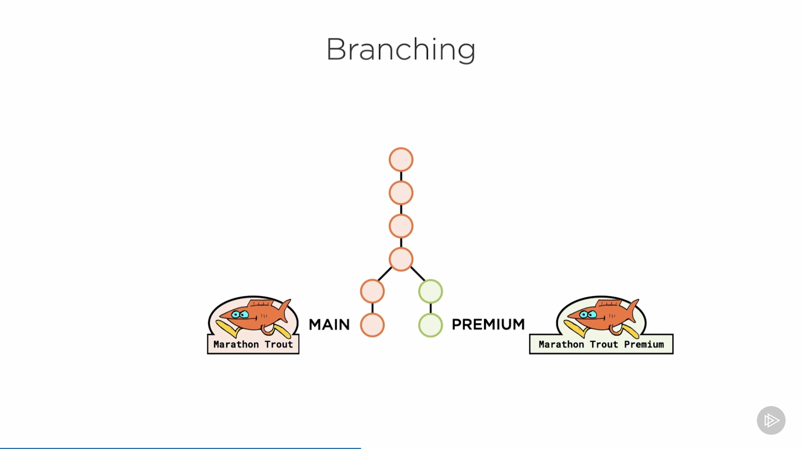

```
git switch <branch name> // switch branches
```

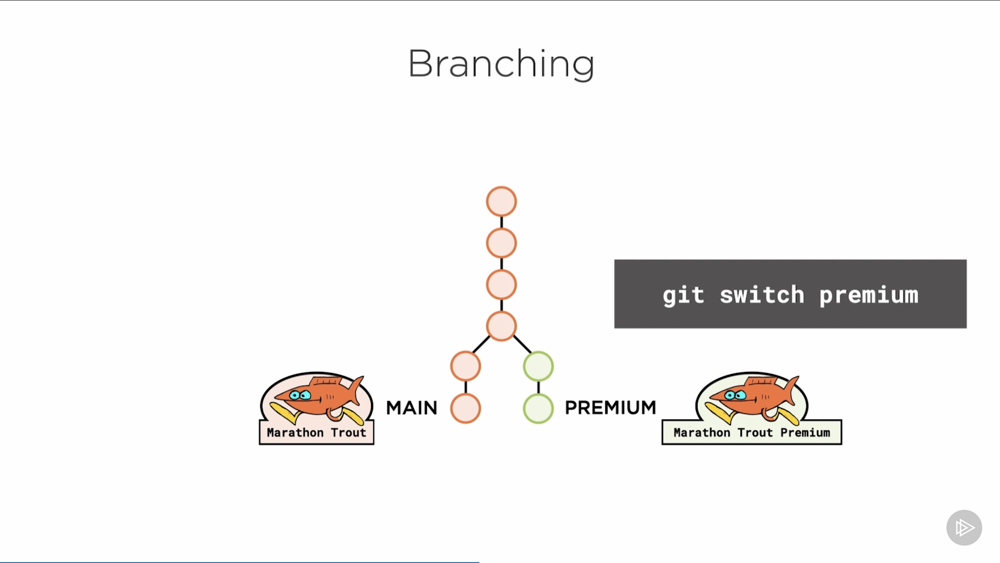
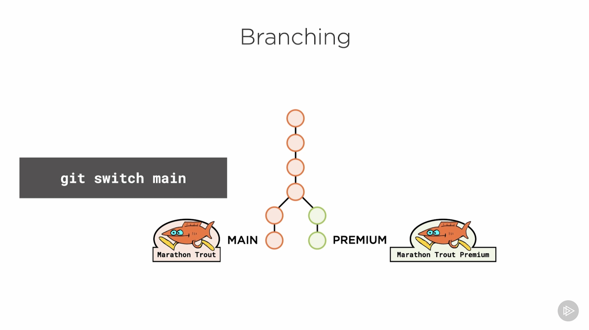

```
git merge // join two or more development histories together
```

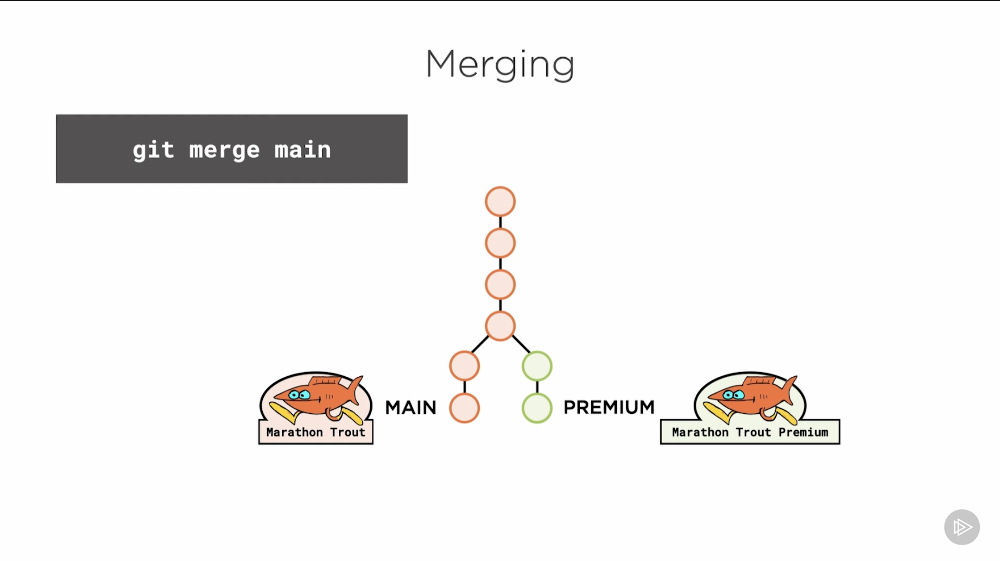

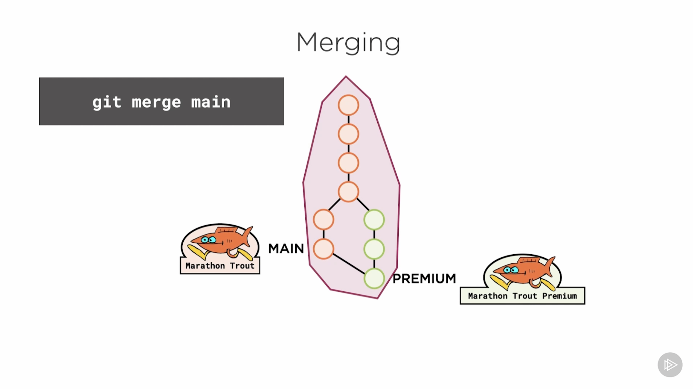

> Premium branch now includes changes from main branch

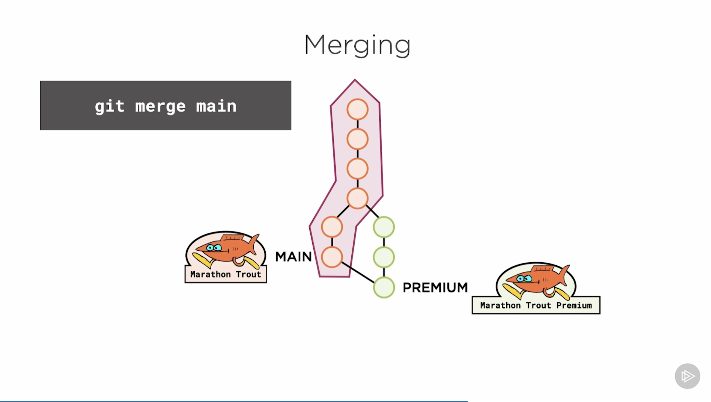

> Main branch is left as it is
