# **BEGINNER**

## **Getting Started with Git**

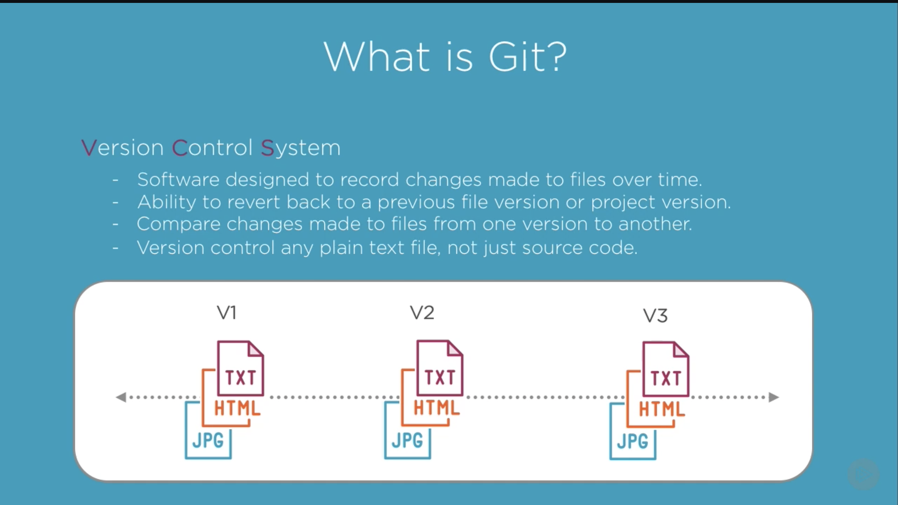

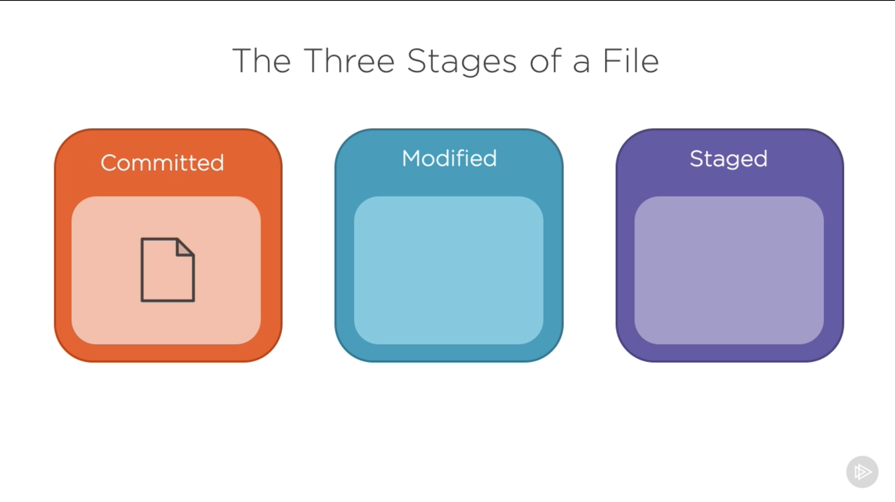
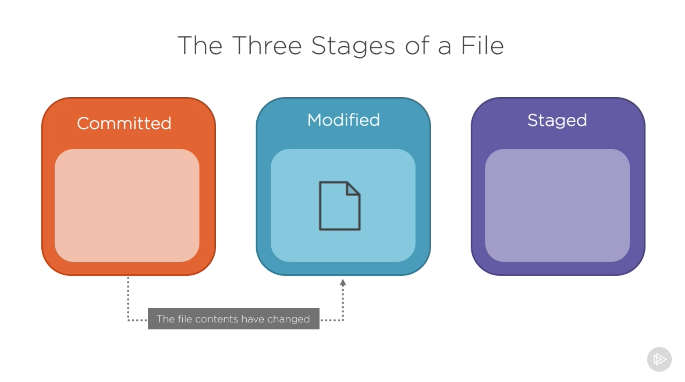
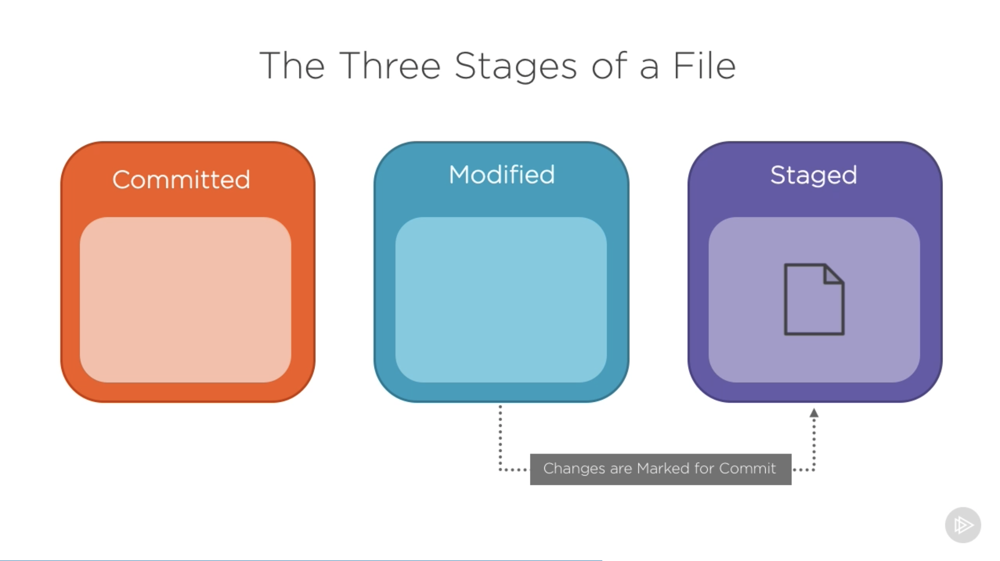
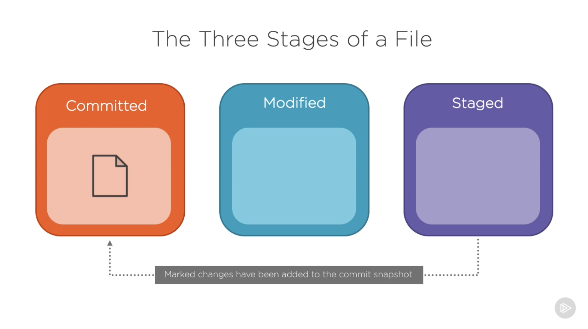

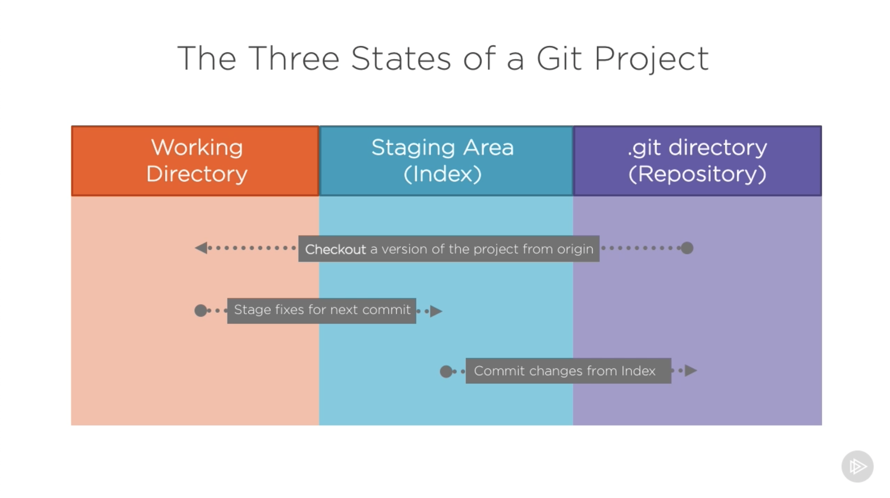
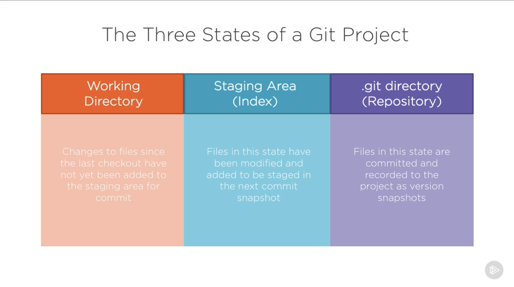

### Using the Command Line

```
pwd // print working directory
cd // change working directory
ls // list files in a directory (dir for windows)
touch // create a new empty file (copy con for windows)
mkdir // create a new empty folder
```

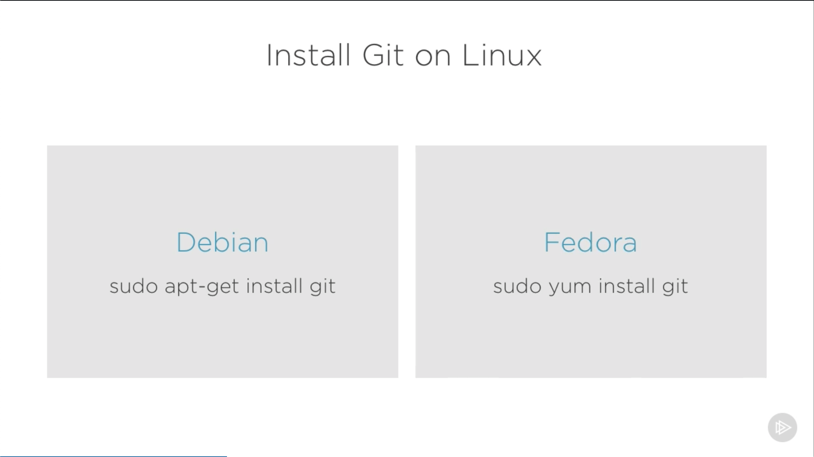
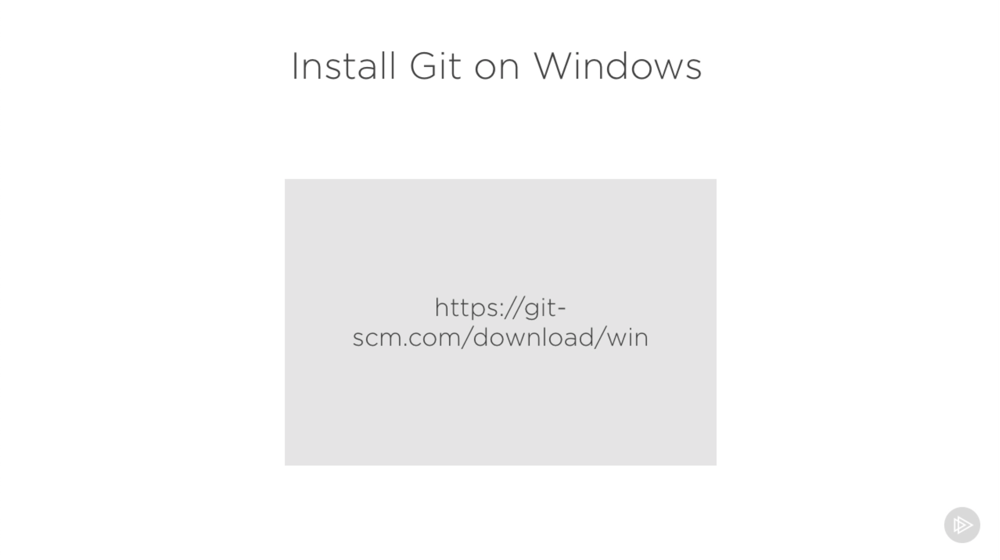

> https://git-scm.com/download/win
> will also install Git Bash

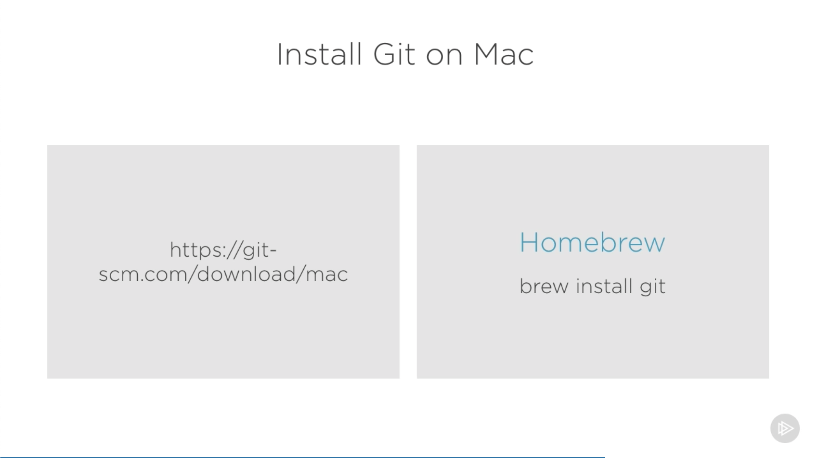

> https://git-scm.com/download/mac
> Homebrew - software package maneger

```
git --version // check your current version of Git

configure Git globally
git config --global user.name <name> // set your Git username
git config --global user.email <name> // set your Git email
configure Git per project
git config user.name <name> // set your Git username
git config user.email <email> // set your Git email
```

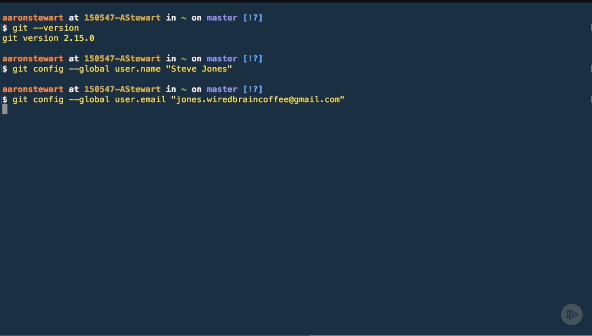

```
man git // open Git manual (has sections like HIGH-LEVEL COMMANDS(PORCELAIN) - most commonly used commands, LOW-LEVEL COMMANDS(PLUMBING) - commands primarily for scripted use)
git help <manual section> // open specific section of Git manual
git help // quick reference guide, mostly common and used commands
```

**Git repository (repo)** - vertual storage of your project. In other words, each project in Git is referenced as a repository.

```
git init // create an empty Git repository or reinitialize an existing one
```
